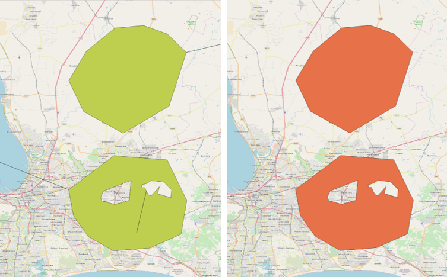
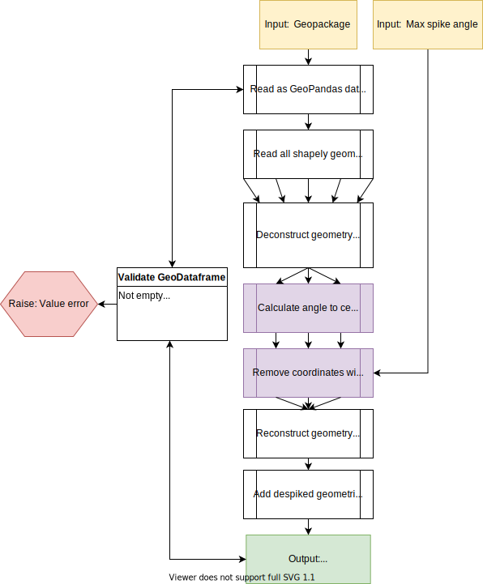

[](https://microbadger.com/images/andretheronsa/spiky)
[](https://spiky.readthedocs.io/en/latest/?badge=latest)

[](https://app.codacy.com/manual/andretheronsa/spiky?utm_source=github.com&utm_medium=referral&utm_content=andretheronsa/spiky&utm_campaign=Badge_Grade_Dashboard)

# Spiky

Spiky removes spikes from GeoPackage shapes



## Overview

Latest docs are available at: [Readthedocs](https://spiky.readthedocs.io/en/latest/?)

### Spike definition
* A single outlier vertex between two vertices that forms an acute angle to them  
* A shape can have more than one spike  
* Spikes could be inward or outward  
* Spikes can be on exterior and on one or more interior polygon boundaries  
* Geographical location and scale should not affect spike detection  
* Topology and geometry should be preserved - no simplifying  

### Operation
* Accepts a positional argument for filename  
* Optionally accepts a max spike angle parameter (-a: float)  
* Removes spikes for all shapes in the GeoPackage  
* Writes out new file (*_ds.gpkg) to same folder as input  
* Spiky functions can also be be imported if analysis on GeoPackage components is required 



### Limitations
* Does not consider geometries with dimensions higher than 2d (z, m)  
* Input must be in geographic coordinates referenced to WGS84  

## Getting started

### Docker

The simplest way of using the tool is to run the Docker image

The latest Docker image is available at: [Dockerhub](https://hub.docker.com/repository/docker/andretheronsa/spiky)

1. Pull image with:  
```shell
docker pull andretheronsa/spiky:latest
```
2. Run program and mount directory with file as a volume to /home/work/:  
```shell
docker run -v /home/user/input/:/home/work/ andretheronsa/spiky:latest spiky-polygons.gpkg
```
3. Outputs will be written to the same folder with '_ds' appended.  

### Local Python environment + script

Alternatively the tool can be downloaded and run with Python (3.5+).  
Required modules should be installed with pip.  
It is highly recommended to use Python Virtual environments (or similar tool) to avoid conflicts.  
Pip install on Windows will fail due to missing Geopandas dependencies - [instructions](https://geopandas.org/install.html).  
Wheels for GDAL, Fiona, Shapely, Pyproj, Rtree can be found [here](https://www.lfd.uci.edu/~gohlke/pythonlibs/)

1. Pull code from git:  
```shell
git clone https://github.com/andretheronsa/spiky.git
```
2. Enter folder and activate virtual environment (venv used in this case):  
```shell
cd spiky/
python -m venv venv
./venv/Scripts/active

```
4. Install dependencies:  
```shell
python3 -m pip install -r requirements.txt
```
5. Run program with arguments:  
```shell
python3 spiky.py /home/user/spiky-polygon.gpkg -a 1
```
6. Outputs will be written to the same folder with '_ds' appended.  

## Tests

* Testing is done with Pytest and automated during master deploy using Github actions.  
* Test spiky and despiked dataset can be found in /tests/fixtures.  

### TODO

* Enable Line, MultiLine, or MultiPolygon geometries  
* Enable pip setuptools install  

## Author

Andre Theron
andretheronsa@gmail.com
